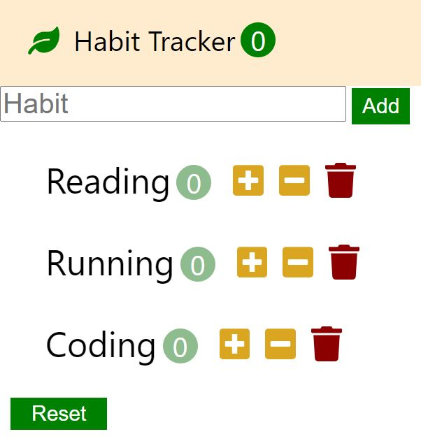

# Habit Tracker

## Habit Tracker application built on React
* [Javascript](#Javascript)
* [React](#React)

## Features
* The user is able to create new habits
* The user is able to increase and decrease the number of activities.
* The user is able to delete habits.
* The user is able to track the number of total habits

## Sources
This app is inspired by Dream Coding Challenge.
